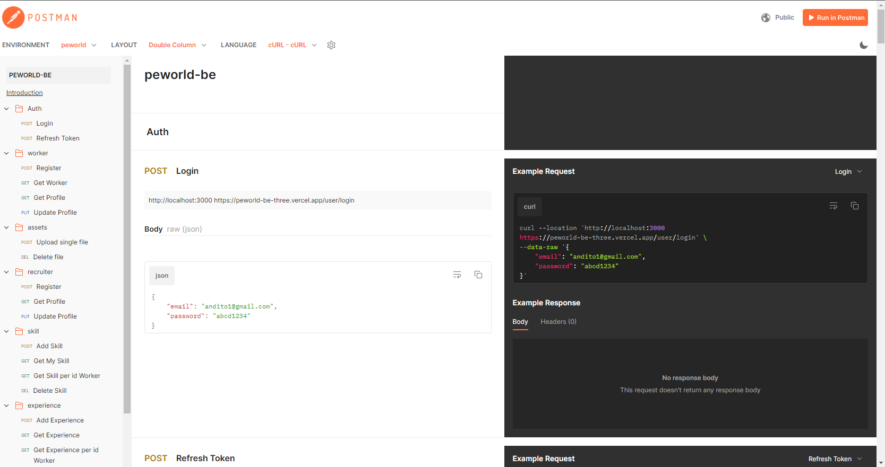

<p align="center">
  
</p>

<h1 align="center">
  <a href="https://git.io/typing-svg">
    
  </a>
</h1>

Peworld is a leading platform for finding and connecting the best talents with quality companies. We are committed to shaping the future in the Fourth Industrial Revolution by providing access to the finest talent network and an efficient recruitment experience.

## Tech Stack

**Programming language:** JavaScript (Node JS)

**Framework:** Express JS

**Database:** PostgreSQL

**API Testing:** Postman

**Authentication:** JWT (JSON Web Tokens)

[](https://skillicons.dev)

## Features

⚡ Users can create worker and recruiter accounts

⚡Users can edit their profiles (worker or recruiter)

⚡ Users can view the profiles of workers ready to be recruited

⚡ Recruiters can send recruitment invitations to workers

⚡ Workers can add and delete portfolios and skills

## Installation

#### Clone this repository :

```bash
  git clone https://github.com/anditorp/peworld-be
```

#### Install Module on Project Directory :

```bash
  npm install
```

#### Start the project :

```bash
  npm run dev
```

## Environment Variables

To run this project, you will need to add the following environment variables to your .env file

`PG_USER`

`PG_PASSWORD`

`PG_HOST`

`PG_DATABASE`

`PG_PORT`

`PORT`

`SECRET_KEY_JWT`

## Postman Documentation

[](https://documenter.getpostman.com/view/33569453/2sA3XTezzX)



## Contact

<a href="mailto:muhamadandito78@gmail.com">
   : muhamadandito78@gmail.com
</a>
<br>
<a href="https://www.linkedin.com/in/anditorp/">
   : https://www.linkedin.com/in/anditorp/
</a>
<br>
<a href="https://github.com/anditorp">
   : https://github.com/anditorp/
</a>
<br>

## Related Project

<a href="https://github.com/anditorp/peworld-fe">
   : peworld-web
</a>
<br>
<a href="https://github.com/anditorp/peworld-mobile">
   : peworld-mobile
</a>

## License

This project is licensed under the MIT License - see the [LICENSE](LICENSE) file for details.
